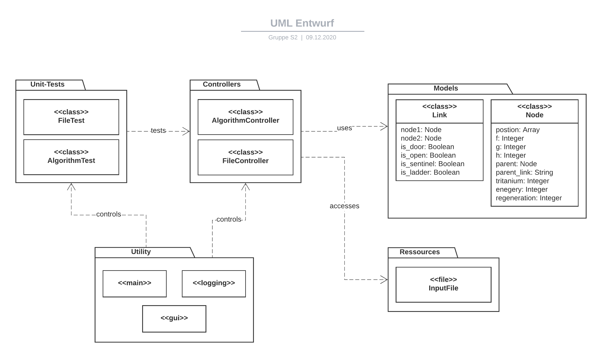

# Technische Dokumentation
> Hier ist alles dokumentiert, was mit dem Entwurf und der Umsetzung des Programms zu tun hat.
## Entwurf

Das Programm wurde als Konsolenanwendung (CLI) entworfen. Eine besondere Benutzeroberfläche außerhalb der Konsole hat 
nicht genug Vorteile, um die Extra-Arbeit zu rechtfertigen. Ein CLI bietet genug Interaktionmöglichkeiten, um eine 
Datei importieren zu können und Ausgaben zu sehen. 

Mit einer CLI-Anwendung liegt der Benutzerfokus vor allem auf einfacher Bedienung (Input von Commands) und 
lesbaren Outputs (gutes Logging).

Aus der Aufgabenstellung und den Datenspezifikationen können wir ein Paketdiagramm erstellen, auf das wir uns während
der Umsetzung beziehen können.

Bewusst offengelassen sind hier die Controller, Unit-Tests und das Utility Paket. Je nach Erweiterung der Umsetzung
ändern sich auch Methodennamen und Strukturen, sodass es keinen Sinn macht diese im Voraus genau zu definieren. 
Lediglich die Modelle, also die zentralen Objekte, sind von Anfang an definiert.

## Programmstruktur
## Dependencies
## Funktionen und Methoden

Alle Funktionen, Klassenmethoden und Klassen sind inline im Code mit Docstrings dokumentiert. Dies ermöglicht einen 
Export in ein HTML-Dokument, sollte es benötigt sein.